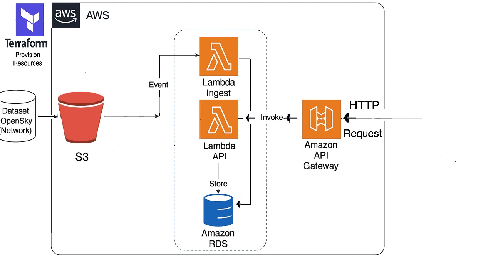

# Serverless AWS Data Ingestion & Reporting Microservice

This project provisions a complete serverless architecture in AWS using Terraform. It ingests flight dataset files into an RDS MySQL database and exposes a reporting API via Lambda + API Gateway

---

##  Features

- Infrastructure as Code using Terraform modules
- Amazon RDS (MySQL) to store flight data which has been taken from OpenSky Network https://zenodo.org/record/5377831
- S3 bucket for data ingestion
- Lambda function to read CSV data from S3 bucket & insert into RDS
- Lambda API function to summarize ingested data
- API Gateway to expose the report API
- Shell script to automate the end-to-end deployment

---

## Architecture Diagram



Ensure that the image file `architecture_diagram.png` is saved in the root of the repo

---

## Problem Statement

> Create a serverless application in AWS using Terraform. The Terraform configuration should create a RDS database, S3 bucket, Lambda function and any other necessary infrastructure components.
>
> The microservice will pull a sample dataset from a file stored in S3 to RDS and provide an API to view the data.
>
> It is recommended to use this dataset from the OpenSky Network https://zenodo.org/record/5377831, but any dataset may be used.
>
> Create Terraform module(s) that will provision a RDS database, S3 bucket, Lambda microservice, and any other required components for access. Write a Lambda microservice using Python3.10+ that consumes any files uploaded to a designated S3 bucket and ingests them into an RDS database.
>
> Write a Lambda API endpoint that provides a JSON summary of the data, including how many rows are ingested and other useful metrics.
>
> Write a basic shell script that uses the Terraform & AWS CLIs to initialize, provision and deploy these resources. It should also handle uploading the chosen dataset to S3 after completion. The script should be something simple enough to include within CICD execution block (ex: a .gitlab-ci.yml “script” block).

---

## Components

### Terraform Modules:
- `vpc` - Subnets and VPC
- `rds` - MySQL DB
- `s3` - Bucket for data uploads
- `lambda_ingest` - Triggered on upload to S3 bucket, ingests CSV to RDS
- `lambda_api` - HTTP-based API to summarize data
- `api_gateway` - Exposes Lambda API publicly

### Lambda Functions:
- **Ingest Lambda**: Triggered by S3 event; decompresses `.gz`, parses CSV, inserts into MySQL RDS
- **API Lambda**: Queries MySQL and returns JSON like:
```json
{
  "row_count": 257000,
  "last_transponder_seen_at": 1548956000,
  "most_popular_destination": "EDDF",
  "count_of_unique_transponders": 51234
}
```

---

## Deployment Instructions

### 1. Prerequisites
- AWS CLI configured with admin privileges
- Terraform >= 1.3
- Python 3.10+

### 2. Setup
```bash
cd serverless-app
chmod +x deploy_serverless_stack.sh
./deploy_serverless_stack_latest.sh
```

### 3. The script will:
- Zip Lambda functions
- Run `terraform init` and `terraform apply`
- Download dataset from OpenSky : https://zenodo.org/record/5377831
- Upload file to S3 which auto-triggers Lambda ingest

---

## Configuration

Update `terraform.tfvars` to customize:
```hcl
db_name            = "openskydb-dataset"
db_username        = "admin123"
bucket_name        = "opensky-dataset-bucket"
mysql engine_version     = "8.0.33"
```

---

## Outputs

After apply, Terraform will print:
- VPC ID
- RDS endpoint
- S3 bucket name
- API Gateway endpoint (for metrics)
- api_route_summary

---

## Accessing the Summary API

Once the infrastructure is deployed using Terraform, we get an output like:

```
api_endpoint = "https://xw6yuryzkc.execute-api.us-east-1.amazonaws.com"
api_route_summary = "/summary"
```

The full API URL becomes:

```
https://xw6yuryzkc.execute-api.us-east-1.amazonaws.com/summary
```

This API endpoint returns a JSON summary of the ingested OpenSky dataset from RDS. The response includes:

- **row_count** – total number of records ingested into RDS
- **last_transponder_seen_at** – latest value of `lastseen` field
- **most_popular_destination** – most common value in the `destination` column
- **count_of_unique_transponders** – distinct count of `icao24` field

---

### Test It via `curl`

```bash
curl -X GET https://xw6yuryzkc.execute-api.us-east-1.amazonaws.com/summary
```

---

### Example Output

```json
{
  "row_count": 26346,
  "last_transponder_seen_at": "2019-01-02 19:18:55",
  "most_popular_destination": "EDDF",
  "count_of_unique_transponders": 14611
}
```

---


## Troubleshooting

- RDS connection issues? Ensure security group allows access
- Lambda failing with `pymysql` error? Ensure this library is zipped correctly
- Use `terraform destroy` to clean up all resources

---

## License

This project is for assessment and demonstration purposes.


